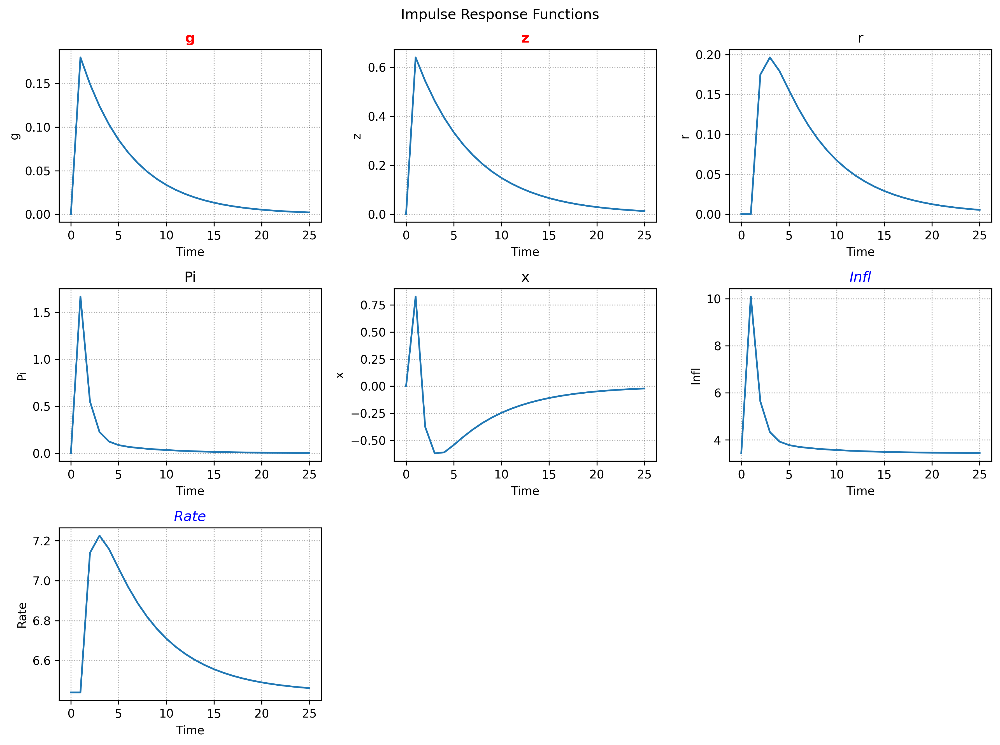
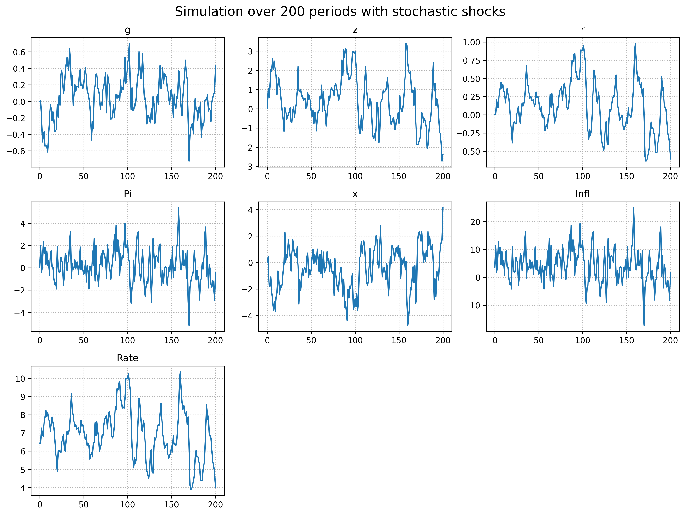

---
tags:
    - guide
---

# Quick Start Guide

??? tip "__TL;DR__"
    You can find a demonstration notebook [here](../assets/guide_notebook.ipynb).

This guide will follow the steps necessary to get from model parsing to simulation.
We will use a pre-defined config file (accessible in the [repository](https://github.com/GongJr0/SymbolicDSGE/)) `"MODELS/POST82.yaml"`.


## Reading Model Configuration

The configuration files are parsed by the `#!python SymbolicDSGE.ModelParser` class.
The class provides `#!python .get()` (model only) and `#!python .get_all()` (model + kalman config).

```python
from SymbolicDSGE import ModelParser
from sympy import Matrix
from warnings import simplefilter, catch_warnings

parsed = ModelParser("MODELS/POST82.yaml").get_all()
model, kalman = parsed

with catch_warnings(): # (1)!
    simplefilter(action="ignore")
    mat = Matrix(model.equations.model)
mat
```

1. Wrapping equations in a `#!python sp.Matrix` is deprecated and used here solely for pretty-printing.

We've read the config and displayed the equations in a matrix:

$$
    \left[\begin{matrix}\Pi{\left(t \right)} = \beta \Pi{\left(t + 1 \right)} + \kappa x{\left(t \right)} + z{\left(t \right)}\\x{\left(t \right)} = - \tau_{inv} \left(- \Pi{\left(t + 1 \right)} + r{\left(t \right)}\right) + g{\left(t \right)} + x{\left(t + 1 \right)}\\r{\left(t \right)} = e_{R} + \rho_{r} r{\left(t - 1 \right)} + \left(1 - \rho_{r}\right) \left(\psi_{\pi} \Pi{\left(t \right)} + \psi_{x} x{\left(t \right)}\right)\\g{\left(t \right)} = e_{g} + \rho_{g} g{\left(t - 1 \right)}\\z{\left(t \right)} = e_{z} + \rho_{z} z{\left(t - 1 \right)}\end{matrix}\right]
$$

We can see that all variables are converted to `#!python SymPy` objects (symbols/functions) and are accessible through the `ModelConfig` interface.

## Compilation

In compilation, the symbolic model is projected into a functionalized and completely numeric form. Time dependent variables are separated and equations are written as lambda objectives. The first order solver consumes the compiled residual through the in house Klein pipeline.

If your model is written in nonlinear levels, pass `#!python linearize=True` to `#!python DSGESolver.compile(...)`. If you need the transformed symbolic equations directly, you can also call `#!python SymbolicDSGE.core.linearize_model(...)` yourself before compilation. The example below uses a model that is already written in linearized gap form.

```python
from SymbolicDSGE import DSGESolver

solver = DSGESolver(model, kalman)
compiled = solver.compile(
    variable_order = None, # (1)!
    params_order=None, # (2)!
    linearize=False, # (3)!
)

print("Equations with symbols removed: \n", "\n".join(map(str, compiled.objective_eqs)))
print("\n")
print("Equations as passed to the solver: \n", compiled.equations)

```

1. `#!python None | list[sp.Function | str]`. `#!python None` uses the variable order in the config file. Custom orders must declare `[*exog, *state, *control]` in that order. If groups are not contiguous or a different order is used, the compiler will raise a validation error. Within groups, any order is accepted.
2. `#!python None | list[str]`. `#!python None` uses the parameter order in the config file.
3. Set to `#!python True` to symbolically linearize the model config before compiling it.

At compilation, the equations are transformed as shown in the code output:
```text
Equations with symbols removed:
 -beta*fwd_Pi + cur_Pi - cur_x*kappa - cur_z
-cur_g + cur_x - fwd_x + tau_inv*(cur_r - fwd_Pi)
-cur_r*rho_r - e_R + fwd_r + (rho_r - 1)*(fwd_Pi*psi_pi + fwd_x*psi_x)
-cur_g*rho_g - e_g + fwd_g
-cur_z*rho_z - e_z + fwd_z


Equations as passed to the solver:
 <function DSGESolver.compile.<locals>.equations at 0x0000012D16AB5B20>
```

???+ note "Variable Layout"
    The compiler infers the canonical solver layout from the configuration. Shock-map targets form the shocked/exogenous state block, dynamic equations determine the remaining state variables, and the rest are controls.

    If you pass `#!python variable_order`, `#!python n_state`, or `#!python n_exog`, they are treated as explicit expectations. The compiler checks them against the inferred layout and raises if they do not match the config.

???+ note "Linearization"
    When passing the linearization flag, the parsed `ModelConfig` must have the linearization parameters defined. (refer to the [Config Guide](./model_config_guide.md))
    Alternatively, you can import `SymbolicDSGE.linearize_model` to use the syntax `lin_config = linearize_model(my_config)`. 

## Solution

The solution step takes steady-state values and optionally parameter calibrations to provide a `#!python SolvedModel`.

```python
from numpy import float64, array

sol = solver.solve(
    compiled,
    parameters=None, # (1)!
    steady_state=[0.0, 0.0, 0.0, 0.0, 0.0],
)
print("Is stable: ", sol.policy.stab == 0)  # (2)!
print("Eigenvalues: ", sol.policy.eig)
```

1. `#!python None | dict[str, float]`. `#!python None` uses the values in `#!python ModelConfig.calibration`
2. stable if `#!python sol.policy.stab == 0`

<div class="annotate" markdown>
```
Is stable:  True
Eigenvalues:  [0.27920118+0.j 0.83000003+0.j 0.84999992+0.j 2.56517116+0.j
 1.18470582+0.j] (1)
```
</div>
1. Complex numbers are an artifact of the ordered Schur solve. All relevant matrices are cast to reals with `#!python np.real_if_close`

## Inspecting Model Dynamics

While we can check the matrices directly, we can also use the built-in methods `#!python SolvedModel.irf` and `#!python SolvedModel.transition_plot` to display the dynamics.

```python
irf_dict = sol.irf(
    T=25,
    shocks=["g", "z"],
    scale=1.0,  # (1)!
    observables=True,  # (2)!
)
sol.transition_plot(
    T=25,
    shocks=["g", "z"],
    scale=1.0,
    observables=True,
)
irf_dict["z"] # (3)!
```

1. `#!python shock = sig_var * scale`
2. Include observables in output.
3. Path of the variable `#!python z`.

This produces the outputs:


```text
array([0.        , 0.64      , 0.54399995, 0.46239991, 0.39303989,
       0.33408388, 0.28397127, 0.24137556, 0.2051692 , 0.17439381,
       0.14823472, 0.1259995 , 0.10709957, 0.09103462, 0.07737942,
       0.0657725 , 0.05590662, 0.04752063, 0.04039253, 0.03433365,
       0.0291836 , 0.02480605, 0.02108514, 0.01792237, 0.01523401,
       0.01294891])
```

## Simulation

`#!python SolvedModel` also supplies a `#!python .sim()` method for simulations.
The method simulates `T` steps given an initial state array and a shock specification.

Shock specifications can take three basic forms.

- A `#!python Shock` distribution spec
- A callable returning the complete shock array: `#!python Callable[[float | ndarray], ndarray]`
- A `#!python np.ndarray` of innovations

Any specification is delivered to `.sim` in a dictionary corresponding to the variable the innovations are meant to affect.
In case of multiple shocks with correlation the key for the dictionary uses `"g,z"` syntax. In correlated cases, `Shock` and callable values receive the model covariance matrix, while array values must have shape `(T, n_correlated_shocks)`.

`SymbolicDSGE.Shock` is an interface simplifying the shock generation process. It can be passed directly to `.sim`, which materializes a `T` period draw at simulation time. The class has support for all `SciPy` distributions from the `rv_generic` and `multi_rv_generic` hierarchies. Alongside `SciPy` support, custom distributions implementing the `.rvs` method are supported through distribution `args`/`kwargs`.

```python
from SymbolicDSGE import Shock

T = 200
shock_spec = lambda seed: Shock( # (1)!
    dist="norm",
    multivar=True,
    seed=seed, # (2)!
    dist_kwargs={ # (3)!
        "mean": [0.0, 0.0],
    },
)

sim_shocks = {
    "g,z": shock_spec(seed=1) # (4)!
}

```

1. Notice the seed argument to the class being parametrized through a lambda. This step is not necessary for functionality. It saves the code of declaring two instances with different seeds if two shocks share distributions.
2. Seed is passed through here, the code below would operate the same if we used `seed=1` instead of using a lambda.
3. The `kwargs` specified here are passed to the distribution object in the backend (to `SciPy`'s `rvs` methods in this case)
4. The value in this pair is a `Shock` object. `.sim` supplies the horizon and constructs the appropriate standard deviation or covariance from model parameters.

With the shocks specified, we can simulate stochastic paths as follows:

```python
import pandas as pd

sim_data = sol.sim(
    T=T,
    x0=[0.0, 0.0, 0.0, 0.0, 0.0],  # (1)!
    shocks=sim_shocks,
    shock_scale=1.0,
    observables=True,
)
del sim_data["_X"]  # (2)!
pd.DataFrame(sim_data).head(10)
```

1. Simulation starts at steady state
2. `"_X"` is a `ndarray` of all non-observable states for each time t. It is deleted here for code brevity in producing a `DataFrame`.

|    |  __g__  | __z__  | __r__  |  __Pi__ |  __x__  |__Infl__ |__Rate__|
|:--:|:-------:|:------:|:------:|:-------:|:-------:|:-------:|:------:|
|  0 |  0      | 0      | 0      |  0      |  0      |  3.43   | 6.44   |
|  1 |  0.0113 | 1.0502 | 0      |  2.0097 |  0.4527 | 11.469  | 6.44   |
|  2 | -0.2055 | 0.5741 | 0.205  | -0.4441 | -1.6807 |  1.6538 | 7.2601 |
|  3 | -0.4925 | 1.0832 | 0.1083 |  0.2587 | -1.8046 |  4.4646 | 6.873  |
|  4 | -0.4139 | 2.0507 | 0.0962 |  2.3427 | -1.0963 | 12.8009 | 6.8249 |
|  5 | -0.3628 | 1.9517 | 0.3014 |  1.2818 | -2.2254 |  8.557  | 7.6456 |
|  6 | -0.5415 | 2.6315 | 0.3544 |  1.8491 | -2.8505 | 10.8264 | 7.8577 |
|  7 | -0.5357 | 2.0374 | 0.4482 |  0.2843 | -3.6404 |  4.5671 | 8.233  |
|  8 | -0.5484 | 2.477  | 0.362  |  1.503  | -2.9801 |  9.442  | 7.8881 |
|  9 | -0.6129 | 2.0109 | 0.4187 |  0.1822 | -3.7172 |  4.1587 | 8.1148 |

Alternative to a DataFrame, we can also plot the simulated paths:

```python
from numpy import ceil, sqrt
import matplotlib.pyplot as plt

fig_square = ceil(sqrt(len(sim_data))).astype(int)
size = (4 * fig_square, 3 * fig_square)
fig, ax = plt.subplots(fig_square, fig_square, figsize=size)
ax = ax.flatten()

while len(ax) > len(sim_data):
    fig.delaxes(ax[-1])
    ax = ax[:-1]

for i, (var, path) in enumerate(sim_data.items()):
    ax[i].plot(path)
    ax[i].set_title(var)
    ax[i].grid(linestyle=":")
plt.suptitle(f"Simulation over {T} periods with stochastic shocks", fontsize=16)
plt.tight_layout()
```



## Further Steps

This guide covers the basic capabilities and usage of `SymbolicDSGE`. Further tools include:

- `SymbolicDSGE.FRED` for easy U.S. macro data retrieval
- `SymbolicDSGE.math_utils` for basic detrending, HP filters, etc.
- `SymbolicDSGE.KalmanFilter` for a one-sided Kalman Filter implementation. (standalone as of now but easy model integration interface will be developed)

If you've read to this point and would like to inspect/interact with the code this guide refers to, you can visit [this](../assets/guide_notebook.ipynb) link to the file.

[Download Guide Notebook](../assets/guide_notebook.ipynb){ .md-button download="" }
