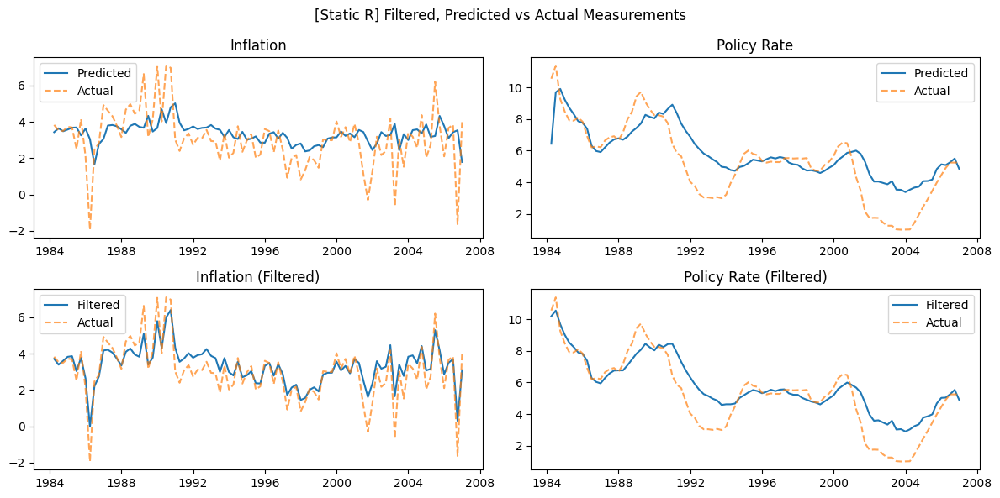
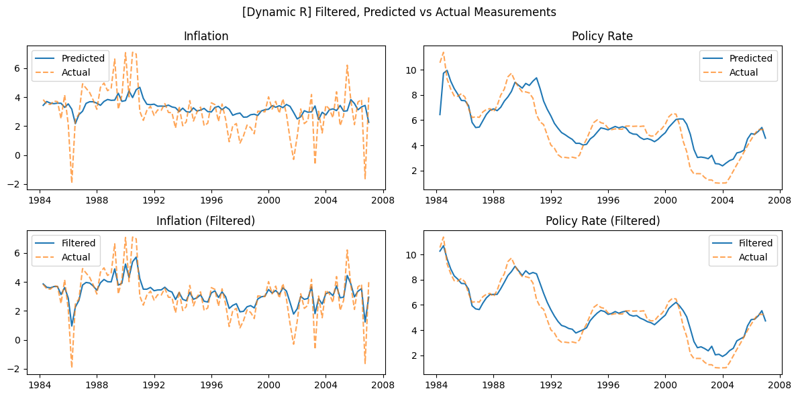
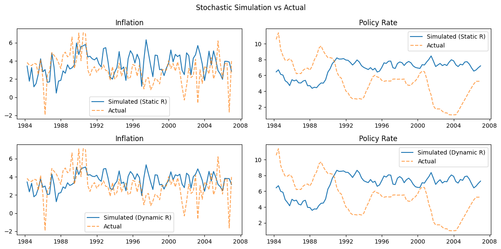

---
tags:
    - guide
---

# Estimation Guide

??? tip "TL;DR"
    Refer to [this](../assets/param_estimation.ipynb) notebook for an example parameter estimation workflow.

??? warning "Read the Quickstart Guide"
    This guide only handles the estimation process and is written assuming the reader have some familiarity for the core DSGE API (i.e. `DSGESolver`, `SolvedModel` etc.). It is strongly recommended to at least have read the [Quickstart Guide](./quickstart.md) before working with parameter estimation.

This guide walks through the parameter estimation workflow of `SymbolicDSGE` using an example setup and a MCMC sampling based Bayesian Estimation setup.

We will cover:

- How priors are built (and why transforms matter)
- How to run MCMC through `DSGESolver.estimate_and_solve(...)`
- What outputs to expect from the process
- How static-`R` vs dynamic-`R` updates change fit diagnostics

## Parse Configs and Compile

```python
from SymbolicDSGE import ModelParser, DSGESolver

parsed = ModelParser("MODELS/POST82.yaml").get_all()
model, kalman = parsed

solver = DSGESolver(model, kalman)
compiled = solver.compile(
    n_state=3, # (1)!
    n_exog=3, # (2)!
)
```

1. Number of state variables for the linear solver backend.
2. Number of exogenous variables; first `n_exog` variables must match the exogenous order contract.

???+ note "Data Input"
    In this example, observed "measurements" are pulled from `FRED` and transformed into model units first. In this guide we assume you already have `observed` as a `DataFrame` with observable columns.

## Prior Specification

Priors are objects we use to define our "prior beliefs" about a parameter. To give a quick example, take a model parameter $\beta$ (discount factor).
In theory, $\beta$ can be any number such that $\beta \in (0,1)$. However, we know that $\beta$ should reside more or less within $0.95 \pm 0.05$. We can use a prior on $\beta$ to penalize the optimizer when it strays further away from our belief to ensure our parameter estimations remain economically interpretable. In `SymbolicDSGE` priors can be defined with the `make_prior` function as such:

```python
from SymbolicDSGE.bayesian import make_prior

beta_prior = make_prior(
    distribution="beta", # (1)!
    parameters={"a": 200 * 0.971, "b": 200 * 0.029}, # (2)!
    transform="logit", # (3)!
    transform_kwargs={} # (4)!
)
```

1. Distribution in parameter space.
2. Parameters of the distribution. This yields a Beta distribution with heavily concentrated probability mass around the mean of 0.971.
3. Transform function mapping the parameter space to the unconstrained optimizer space. Here, `logit` maps `(0, 1) -> (-inf, inf)`.
4. Parameters of the transform function are passed here if necessary.

The prior specification defines `Distribution`s such that the optimizer can interact with the distribution object on the unconstrained space.
For example, in order to optimize in an unbounded search space $\R = (-\infty, \infty)$ we can use any distribution of our choosing regardless of the bounds,
as long as we specify a `Transform` that maps the distribution support $(a, b) \mapsto \R$. We then rely on the `Transform` objects to apply a "Change of Variables" to produce the unbounded search input. The `Transform` will also be responsible for inverting the optimizer output into the parameter space ($\R \mapsto (a,b)$) we wish to search over. To give a concrete example, a logit transform for example would map $(0,1) \mapsto\R$ in the forward direction. In this scenario the inverse logit would precisely do the opposite $ inv(Z) \to X, \, X \in (0,1) $.

??? info "Change of Variables Details"
    All transformations except `Identity` (which returns the input itself as output) are examples of the procedute defined in calculus as [Change of Variables](https://en.wikipedia.org/wiki/Change_of_variables). We deal with a specific [subset](https://en.wikipedia.org/wiki/Probability_density_function#Function_of_random_variables_and_change_of_variables_in_the_probability_density_function) of this procedure relating to probability density functions (PDFs). Below we will show how applying/inverting a transform function blindly results in inaccurate conversions and try to outline an intuition for the process. We will try to make it as easy to reason about as possible and some details can get skipped.

    A random variable $Z \in\R$ can follow any distribution $f_z(Z)\in\R$. However after applying any transformation $Z \to X$ such that $Z \neq X$; we can intuitively (and mathematically) agree that the distribution $f_z(X)$ no longer accurately describes the density of the transformed variable $X$.

    Fortunately, there's a deterministic and generally applicable correction we can use to ensure $f_z(Z)$ can be accurately represented in of $X$. Denoting the transformation $g_z(Z) \to X$, we can adjust for the mismatch in densities using the derivative (or Jacobian) $\frac{d}{dZ}g_z(Z)$. Skipping the theory, the important bit of knowledge is that $f_z(X)$ is off from the accurate description of $X$'s probability distribution by a factor of the above specified derivative. Therefore, in the scalar case we can denote:

    $$
    f_z(Z) = f_z(X) \times \left|\frac{d}{dx}g_z\left(X\right)\right| \Longleftrightarrow \ln\left(f_z\left(Z\right)\right) = \ln\left(f_z\left(X\right)\right) + \ln\Biggl(\left|\frac{d}{dX}g_z(X)\right|\Biggl)
    $$

Using `make_prior` we can define individual priors for each parameter we wish to estimate:

```python
prior_spec = {
    "beta": make_prior(
        "beta",
        parameters={"mean": 200*0.971, "b": 200*0.029},
        transform="logit", # (1)!
    ),
    "kappa": make_prior(
        "gamma",
        parameters={"mean": 0.58, "std": 0.1},
        transform="log", # (2)!
    ),

    ...,

    "rho_gz": make_prior(
        "normal",
        parameters={"mean": 0.0, "std": 0.2},
        transform="affine_logit", # (3)!
        transform_kwargs={"low": -1.0, "high": 1.0}
    ),
    "sig_r": make_prior(
        "gamma",
        parameters={"mean": 0.18, "std": 0.1},
        transform="log",
    ),
}
```

1. `logit` does not require parameters and (inverse) transforms to (0, 1)
2. `log` maps real numbers to non-negative reals without requiring parameters.
3. `affine_logit` takes a low ($a$) and high ($b$) bound to map (a, b)

## Running the Estimation

The estimation process is carried out by `DSGESolver.estimate()` and `DSGESolver.estimate_and_solve`. The former returns the estimation results, but does not provide a `SolvedModel` using said estimation output. Conversely, the latter provides both the results, and an immediately usable `SolvedModel` object derived from the results.

```python
res, sol = solver.estimate_and_solve(
    compiled=compiled,
    y=observed, # (1)!
    method="mcmc", # (2)!
    priors=prior_spec,
    estimated_params=list(prior_spec.keys()),
    steady_state=[0.0, 0.0, 0.0, 0.0, 0.0],
    posterior_point='mean', # (3)!
    n_draws=1000, # (4)!
    burn_in=500, # (5)!
    thin=1, # (6)!
    update_R_in_iterations=False, # (7)!
)
```

1. Observed data we want to calibrate against
2. Chosen from `{'mle', 'map', 'mcmc'}`.
3. Which point from the posterior distribution to use as parameters. Chosen from `{'mean', 'mode' == 'map', 'last'}`.
4. Retained draws.
5. Burn-in iterations.
6. Keeps every `thin`-th draw. Specifying a `thin` > 1 discards some samples and is commonly used to prevent autocorrelation.
7. If parameters of R are being estimated, setting this to `True` will re-compute the R matrix using the current sample's parameters.
   Otherwise, R will be estimated once before the run begins and will be kept static throughout the run.

```text
MCMC sampling concluded in 34.93 seconds with 42.95 iterations per second.
[Estimator:mcmc] BK stability warnings encountered during search: 0
```

## Inspecting the Results

The estimation will return a `MCMCResult` or `OptimizationResult` depending on the specified `method`. Alongside other metadata, these objects report:

- Order of parameters in the sample array(s)
- Each sample drawn (if multiple are drawn)
- Log-Likelihood of each sample

The result objects are a raw outlook into the estimator internals during the method run. Information regarding the parameters selected can be derived from a result object; or the `SolvedModel` objects can be directly inspected via `SolvedModel.config.calibration.parameters`.

Below is a snippet creating a "summary" report given a result object:

```python
import numpy as np
import pandas as pd

pd.Series(
    {
        **dict(zip(res.param_names, np.mean(res.samples, axis=0))),  # (1)!
        "loglik": np.mean(res.logpost_trace),
        "accept_rate": res.accept_rate,  # (2)!
        "n_draws": res.n_draws,
        "burn_in": res.burn_in,
        "thin": res.thin,
    }
)
```

1. We used `posterior_point='mean'`, therefore we're computing the mean of all sample draws to accurately recreate the parameters being used inside the model.
2. Acceptance rate is specific to MCMC and is a percent measure of how many samples were "acceptable" within the specified priors and bounds; and of course, model stability constraints. (An unsolvable model is automatically disqualified)

```text
beta              0.971773
rho_r             0.840123
rho_g             0.860232
rho_z             0.873493
psi_pi            2.736531
psi_x             0.339134
kappa             0.366632
tau_inv           0.569496
rho_gz            0.149944
meas_rho_ir       0.230454
sig_r             0.143704
sig_g             0.150102
sig_z             0.685228
meas_infl         0.574781
meas_rate         0.934977
loglik         -300.602336
accept_rate       0.328667
n_draws        1000.000000
burn_in         500.000000
thin              1.000000
dtype: float64
```

## Fit Diagnostics

In this section we will compare the filtered and predicted states coming from a Kalman Filter (KF) ran on:

1. A model using static $R$ to estimate parameters
2. The same model using dynamic $R$ to estimate parameters

Both predicted measurements `y_pred` and filtered measurements `y_filt` will be compared against the actual observed data used in estimation.
Afterwards, a simulation using identical shock arrays for static and dynamic estimated models will be compared against the actual data.

Static `R` fit:



Dynamic `R` fit:



Simulation vs actual (both solutions):



## Practical Notes

???+ note "When to Use MLE vs MAP vs MCMC"
    - `MLE`: MLE is a so called "pure" estimation technique used if and only if we want the set of parameters that best fit the data; without imposing any other constraints.
    - `MAP`: MAP is similar to MLE in the sense that it returns a single set of parameters maximizing a given objective. However, MAP has prior beliefs in the objective function. Therefore, the maximization yields a result both respecting the plain likelihood and our beliefs regarding parameters.
    - `MCMC`: MCMC is a sampling method aimed to generate a posterior distribution using our prior beliefs and the likelihood. Effectively, MCMC samples multiple parameter sets sampled with respect to priors and computes their likelihood. In this case, we no longer have a maximization problem; we create a sampled distribution and use a point in said distribution as the parameters. This approach often yields more stable parameter compositions and allows more freedom regarding exactly which "point" to select as the parameters.

## Further Steps

More detailed information regarding estimation can be found via the references. Alternatively you can refer to [this](../assets/guide_notebook.ipynb) example notebook to see parameter estimation workflow used when generating the outputs for this guide.

???+ note "References"
    This guide focuses on solver-facing estimation flow. For API-level references, use:

    - [`Estimator`](../documentation/Estimator.md)
    - [`Prior`](../documentation/prior_spec/Prior.md)
    - [`DSGESolver`](../documentation/DSGESolver.md)

[Download Guide Notebook](../assets/param_estimation.ipynb){ .md-button download="" }
