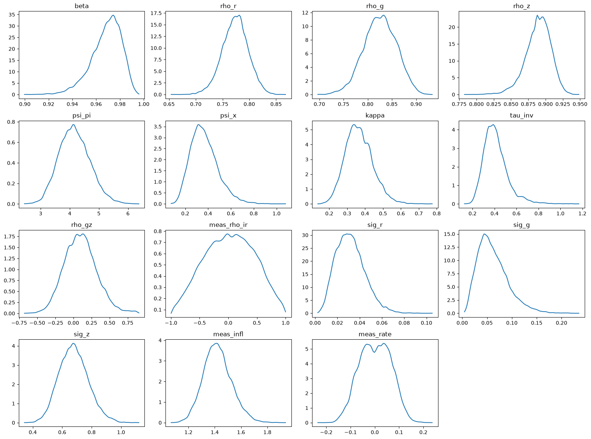
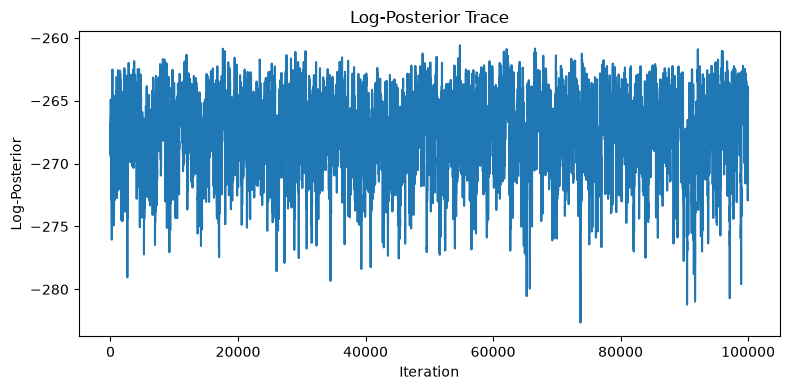

---
tags:
    - guide
---

# Estimation Guide

??? tip "TL;DR"
    Refer to [this](../assets/param_estimation.ipynb) notebook for an example parameter estimation workflow.

???+ warning "Read the Quickstart Guide"
    This guide only handles the estimation process and is written assuming the reader has some familiarity with the core DSGE API (i.e. `DSGESolver`, `SolvedModel` etc.). It is strongly recommended to at least have read the [Quickstart Guide](./quickstart.md) before working with parameter estimation.

This guide walks through the parameter estimation workflow of `SymbolicDSGE` using an example setup and an MCMC sampling based Bayesian Estimation setup.

We will cover:

- How priors are built (and why transforms matter)
- How to run MCMC through `DSGESolver.estimate_and_solve(...)`
- What outputs to expect from the process

## Parse Configs and Compile

```python
from SymbolicDSGE import ModelParser, DSGESolver

parsed = ModelParser("MODELS/POST82.yaml").get_all()
model, kalman = parsed

solver = DSGESolver(model, kalman)
compiled = solver.compile()
```

`compile()` infers the solver variable layout from the model config. If you supply `#!python variable_order`, `#!python n_state`, or `#!python n_exog`, they are checked against the inferred layout and a mismatch raises before the model is solved.

???+ note "Data Input"
    In this example, observed "measurements" are pulled from `FRED` and transformed into model units first. In this guide we assume you already have `observed` as a `DataFrame` with observable columns.

## Prior Specification

Priors are objects we use to define our "prior beliefs" about a parameter. To give a quick example, take a model parameter $\beta$ (discount factor).
In theory, $\beta$ can be any number such that $\beta \in (0,1)$. However, we know that $\beta$ should reside more or less within $0.95 \pm 0.05$. We can use a prior on $\beta$ to penalize the optimizer when it strays further away from our belief to ensure our parameter estimations remain economically interpretable. In `SymbolicDSGE` priors can be defined with the `make_prior` function as such:

```python
from SymbolicDSGE.bayesian import make_prior

beta_prior = make_prior(
    distribution="beta", # (1)!
    parameters={"a": 200 * 0.971, "b": 200 * 0.029}, # (2)!
    transform="logit", # (3)!
    transform_kwargs={} # (4)!
)
```

1. Distribution in parameter space.
2. Parameters of the distribution. This yields a Beta distribution with heavily concentrated probability mass around the mean of 0.971.
3. Transform function mapping the parameter space to the unconstrained optimizer space. Here, `logit` maps `(0, 1) -> (-inf, inf)`.
4. Parameters of the transform function are passed here if necessary.

The prior specification defines `Distribution`s such that the optimizer can interact with the distribution object on the unconstrained space.
For example, in order to optimize in an unbounded search space $\R = (-\infty, \infty)$ we can use any distribution of our choosing regardless of the bounds,
as long as we specify a `Transform` that maps the distribution support $(a, b) \mapsto \R$. We then rely on the `Transform` objects to apply a "Change of Variables" to produce the unbounded search input. The `Transform` will also be responsible for inverting the optimizer output into the parameter space ($\R \mapsto (a,b)$) we wish to search over. To give a concrete example, a logit transform for example would map $(0,1) \mapsto\R$ in the forward direction. In this scenario the inverse logit would precisely do the opposite $ inv(Z) \to X, \, X \in (0,1) $.

??? info "Change of Variables Details"
    All transformations except `Identity` (which returns the input itself as output) are examples of the procedure defined in calculus as [Change of Variables](https://en.wikipedia.org/wiki/Change_of_variables). We deal with a specific [subset](https://en.wikipedia.org/wiki/Probability_density_function#Function_of_random_variables_and_change_of_variables_in_the_probability_density_function) of this procedure relating to probability density functions (PDFs). Below we will show how applying/inverting a transform function blindly results in inaccurate conversions and try to outline an intuition for the process. We will try to make it as easy to reason about as possible and some details can get skipped.

    A random variable $Z \in\R$ can follow any distribution $f_z(Z)\in\R$. However after applying any transformation $Z \to X$ such that $Z \neq X$; we can intuitively (and mathematically) agree that the distribution $f_z(X)$ no longer accurately describes the density of the transformed variable $X$.

    Fortunately, there's a deterministic and generally applicable correction we can use to ensure $f_z(Z)$ can be accurately represented in terms of $X$. Denoting the transformation $g_z(Z) \to X$, we can adjust for the mismatch in densities using the derivative (or Jacobian) $\frac{d}{dZ}g_z(Z)$. Skipping the theory, the important bit of knowledge is that $f_z(X)$ is off from the accurate description of $X$'s probability distribution by a factor of this derivative. Therefore, in the scalar case we can denote:

    $$
    f_z(Z) = f_z(X) \times \left|\frac{d}{dx}g_z\left(X\right)\right| \Longleftrightarrow \ln\left(f_z\left(Z\right)\right) = \ln\left(f_z\left(X\right)\right) + \ln\Biggl(\left|\frac{d}{dX}g_z(X)\right|\Biggl)
    $$

Using `make_prior` we can define individual priors for each parameter we wish to estimate:

```python
prior_spec = {
    "beta": make_prior(
        "beta",
        parameters={"a": 200*0.971, "b": 200*0.029},
        transform="logit", # (1)!
    ),
    "kappa": make_prior(
        "gamma",
        parameters={"mean": 0.58, "std": 0.1},
        transform="log", # (2)!
    ),

    ...,

    "rho_gz": make_prior(
        "normal",
        parameters={"mean": 0.0, "std": 0.2},
        transform="affine_logit", # (3)!
        transform_kwargs={"low": -1.0, "high": 1.0}
    ),
    "sig_r": make_prior(
        "gamma",
        parameters={"mean": 0.18, "std": 0.1},
        transform="log",
    ),
}
```

1. `logit` does not require parameters and (inverse) transforms to (0, 1)
2. `log` maps real numbers to positive reals without requiring parameters.
3. `affine_logit` takes a low ($a$) and high ($b$) bound to map (a, b)

## Running the Estimation

The estimation process is carried out by `DSGESolver.estimate()` and `DSGESolver.estimate_and_solve`. The former returns the estimation results, but does not provide a `SolvedModel` using said estimation output. Conversely, the latter provides both the results, and an immediately usable `SolvedModel` object derived from the results.

```python
res, sol = solver.estimate_and_solve(
    compiled=compiled,
    filter_mode="linear", # (1)!
    y=observed, # (2)!
    observables=["Infl", "Rate"], # (3)!
    method="mcmc", # (4)!
    priors=prior_spec,
    ss_seed=[0.0, 0.0, 0.0, 0.0, 0.0],
    posterior_point='mean', # (5)!
    n_draws=100_000, # (6)!
    burn_in=10_000, # (7)!
    thin=1, # (8)!
)
```

1. Mode of the Kalman Filter used to compute the likelihood. Chosen from `{'linear', 'extended', 'unscented'}`.
2. Observed data we want to calibrate against
3. Which observables to use from the model specification. If not specified, all observables will be used. Number of columns in `y` must match the number of observables in the model specification.
4. Chosen from `{'mle', 'map', 'mcmc'}`.
5. Which point from the posterior distribution to use as parameters. Chosen from `{'mean', 'mode' == 'map', 'last'}`.
6. Effective sample size (retained draws).
7. Burn-in iterations.
8. Keeps every `thin`-th draw. Specifying a `thin` > 1 discards some samples and is commonly used to prevent autocorrelation.

```text
MCMC sampling concluded in 71.61 seconds with 1536.00 iterations per second.
[Estimator:mcmc] BK stability warnings encountered during search: 0
```

???+ note "Filter Mode Selection"
    Filter modes increase in capability and complexity as follows: `linear` < `extended` < `unscented`. Linear doesn't support any non-linearities in the model (transitions and measurements). Extended allows for non-linearities in measurements, but not in transitions. Unscented, which is by far the slowest,
    requires a non-linear (`order>=2`) solution and supports non-linearities in both transitions and measurements. In general, it is recommended to use the simplest possible filter mode that is compatible with a given model. (Note that `extended` on a linear model is equivalent to `linear` but slower.)

???+ note "Draw Count Calculation"
    `n_draws` directly lets you specify the Effective Sample Size (ESS) you want to retain. Given `n_draws`, `burn_in`, and `thin`, the total number of draws an estimation routine will perform is `n_draws * thin + burn_in`.

## Inspecting the Results

The estimation will return a `MCMCResult` or `OptimizationResult` depending on the specified `method`. Alongside other metadata, these objects report:

- Order of parameters in the sample array(s)
- Each sample drawn (if multiple are drawn)
- Log-Likelihood of each sample

The result objects are a raw outlook into the estimator internals during the method run. Information regarding the parameters selected can be derived from a result object; or the `SolvedModel` objects can be directly inspected via `SolvedModel.config.calibration.parameters`.

Below is a snippet creating a "summary" report given a result object:

```python
import numpy as np
import pandas as pd

pd.Series(
    {
        **dict(zip(res.param_names, np.mean(res.samples, axis=0))),  # (1)!
        "loglik": np.mean(res.logpost_trace),
        "accept_rate": res.accept_rate,  # (2)!
        "n_draws": res.n_draws,
        "burn_in": res.burn_in,
        "thin": res.thin,
    }
).round(3)
```

1. We used `posterior_point='mean'`, therefore we're computing the mean of all sample draws to accurately recreate the parameters being used inside the model.
2. Acceptance rate is specific to MCMC and is a percent measure of how many samples were "acceptable" within the specified priors and bounds; and of course, model stability constraints. (An unsolvable model is automatically disqualified)

```text
beta                0.969
rho_r               0.775
rho_g               0.828
rho_z               0.889
psi_pi              4.142
psi_x               0.364
kappa               0.363
tau_inv             0.414
rho_gz              0.085
meas_rho_ir         0.005
sig_r               0.032
sig_g               0.063
sig_z               0.674
meas_infl           1.427
meas_rate           0.002
loglik           -266.964
accept_rate         0.233
n_draws        100000.000
burn_in         10000.000
thin                1.000
dtype: float64
```

## Fit Diagnostics (MCMC)

MCMC sampling produces distributions instead of point estimates. Therefore, indications of estimation quality are visible not only through the specific point estimate (and the likelihood of that point), but also through the behavior of the sampled distribution. `MCMCResult` provides a few methods to visualize some of the common points of inspection when deciding whether the estimation was sufficiently well-behaved.

### Highest Posterior Density (HPD) Intervals

HPD intervals are akin to regular confidence intervals, but are computed from the posterior distribution. The HPD interval is the smallest interval in a trace containing the specified probability mass. Computing the bounds of the HPD interval tells us where the mass is concentrated; multimodal distributions for example can present themselves as a wide HPD interval due to multiple high-mass regions. The HPD interval can be computed using the `MCMCResult.hpd_intervals` method:

```python
res.hpd_intervals(alpha=0.05, n_digits=3) # (1)!
```

1. `alpha` is the probability mass outside the interval. For example, `alpha=0.05` means we want to compute the 95% HPD interval. `n_digits` is the number of digits to round the output to.

```text
{'beta': (np.float64(0.943), np.float64(0.99)),
 'rho_r': (np.float64(0.725), np.float64(0.82)),
 'rho_g': (np.float64(0.762), np.float64(0.891)),
 'rho_z': (np.float64(0.854), np.float64(0.924)),
 'psi_pi': (np.float64(3.122), np.float64(5.171)),
 'psi_x': (np.float64(0.159), np.float64(0.611)),
 'kappa': (np.float64(0.218), np.float64(0.512)),
 'tau_inv': (np.float64(0.216), np.float64(0.631)),
 'rho_gz': (np.float64(-0.326), np.float64(0.543)),
 'meas_rho_ir': (np.float64(-0.843), np.float64(0.843)),
 'sig_r': (np.float64(0.01), np.float64(0.057)),
 'sig_g': (np.float64(0.011), np.float64(0.122)),
 'sig_z': (np.float64(0.491), np.float64(0.875)),
 'meas_infl': (np.float64(1.209), np.float64(1.629)),
 'meas_rate': (np.float64(-0.118), np.float64(0.118))}
```

### Posterior Density Estimation

Each estimated parameter comprises a sampled distribution which can be treated as a marginal posterior distribution. The `MCMCResult.posterior_kde_plot` method uses standard Gaussian Kernel Density Estimation to visualize the posterior distributions of each parameter to scan for abnormalities such as multimodality, skewness, or other.

```python
res.posterior_kde_plot(grid_points=100) # (1)!
```

1. `grid_points` is the number of points to use in the KDE grid. More points yield a smoother curve, but take longer to compute. It's not recommended to use more than 1000 points, density estimation is computationally expensive and runtime can challenge the entire estimation process.



### Log-Posterior Trace

The log-posterior trace is a "time series" of the log-posterior, showing the log-likelihood of each sample drawn in-order. Inspecting this can tell us whether the sampling process was non-convergent, or whether the chain got stuck in a local optimum for a long time. The `MCMCResult.logpost_trace_plot` method can be used to visualize the log-posterior trace.

```python
res.logpost_trace_plot() # (1)!
```

1. The method produces a plot from the `MCMCResult.logpost_trace` array with no parameters required.



## Practical Notes

???+ note "When to Use MLE vs MAP vs MCMC"
    - `MLE`: MLE is a so called "pure" estimation technique used if and only if we want the set of parameters that best fit the data; without imposing any other constraints.
    - `MAP`: MAP is similar to MLE in the sense that it returns a single set of parameters maximizing a given objective. However, MAP has prior beliefs in the objective function. Therefore, the maximization yields a result both respecting the plain likelihood and our beliefs regarding parameters.
    - `MCMC`: MCMC is a sampling method aimed to generate a posterior distribution using our prior beliefs and the likelihood. Effectively, MCMC samples multiple parameter sets sampled with respect to priors and computes their likelihood. In this case, we no longer have a maximization problem; we create a sampled distribution and use a point in said distribution as the parameters. This approach often yields more stable parameter compositions and allows more freedom regarding exactly which "point" to select as the parameters.

???+ warning "Estimating Components of Symmetric Positice Definite Matrices"
    The model and kalman config provides two covariance matrices specified with parameters for standard deviations and the correlation coefficients. These are `Q` and `R` explaining the covariance of shocks and measurement noise respectively. To ensure estimation of any component in these matrices yields a valid covariance matrix, there's logic implemented around estimation to transform these variables. It is recommended to estimate the correlation block of these marices together using the reserved estimation keys: `<R/Q>_corr`. Standard deviations are estimated as scalars and in cases where they lack a prior, the estimation defaults to a log transform ensuring positivity.

## Further Steps

More detailed information regarding estimation can be found via the references. Alternatively you can refer to [this](../assets/guide_notebook.ipynb) example notebook to see parameter estimation workflow used when generating the outputs for this guide.

???+ note "References"
    This guide focuses on solver-facing estimation flow. For API-level references, use:

    - [`Estimator`](../documentation/Estimator.md)
    - [`Prior`](../documentation/prior_spec/Prior.md)
    - [`DSGESolver`](../documentation/DSGESolver.md)

[Download Guide Notebook](../assets/param_estimation.ipynb){ .md-button download="" }
