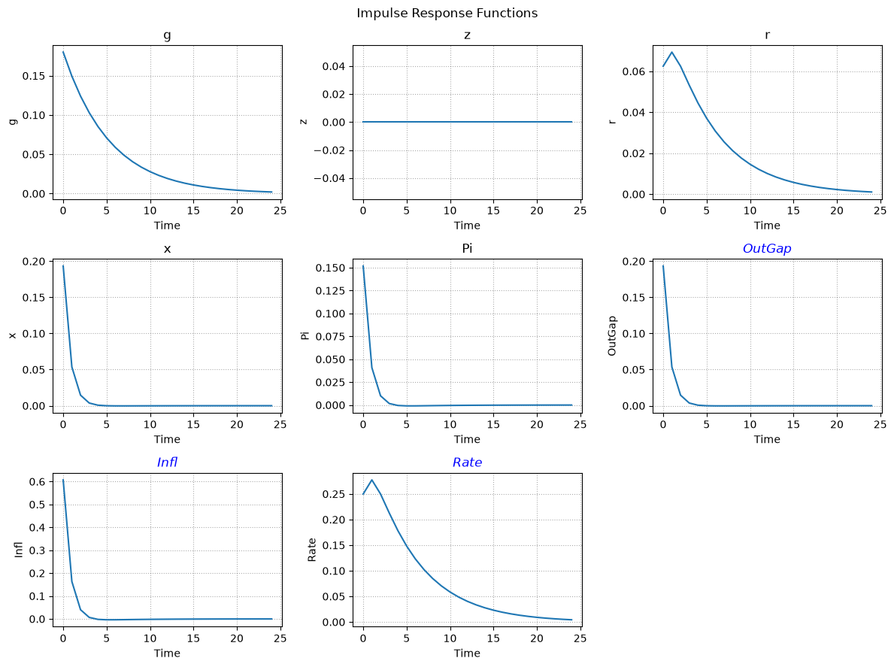
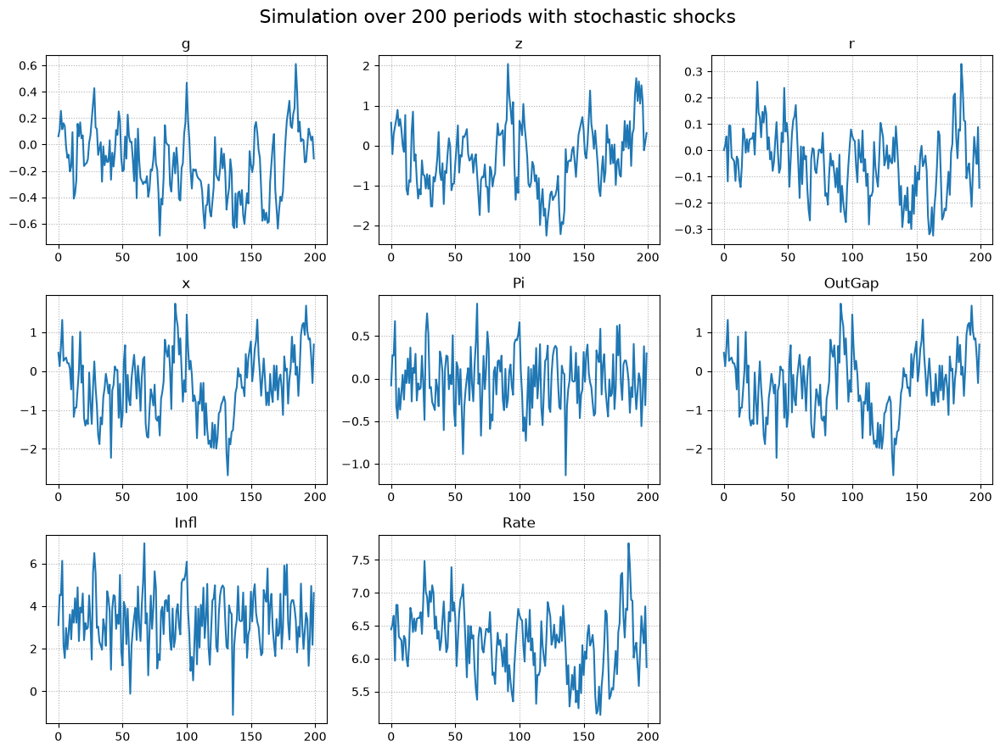

---
tags:
    - guide
---

# Quick Start Guide

??? tip "__TL;DR__"
    You can find a demonstration notebook [here](../assets/guide_notebook.ipynb).

This guide will follow the steps necessary to get from model parsing to simulation.
We will use a pre-defined config file (accessible in the [repository](https://github.com/GongJr0/SymbolicDSGE/)) `"MODELS/POST82.yaml"`.


## Reading Model Configuration

The configuration files are parsed by the `#!python SymbolicDSGE.ModelParser` class.
The class provides `#!python .get()` (model only) and `#!python .get_all()` (model + kalman config).

```python
from SymbolicDSGE import ModelParser, DSGESolver, Shock

from sympy import Matrix
from warnings import catch_warnings, simplefilter

from numpy import ceil, sqrt

import pandas as pd
import matplotlib.pyplot as plt

model, kalman = ModelParser("../../MODELS/POST82.yaml").get_all()

with catch_warnings():
    # Equations in a sp.Matrix are deprecated, this is only used as a pretty print function
    simplefilter(action="ignore")
    mat = Matrix(list(model.equations.model.values()))
mat
```

The notebook opens `POST82.yaml` from `docs/assets`, hence its `../../MODELS` path. From the repository root, use `MODELS/POST82.yaml` instead. The warning filter is only for the `SymPy` matrix display.

This displays the parsed equations as `SymPy` objects. Variables are functions of time, and the configuration retains the equations through the `ModelConfig` interface.

## Compilation

Compilation converts the symbolic model to a numeric residual callback. It desugars longer leads and lags with auxiliary variables, derives the state and control layout from equation timing, and compiles the residual consumed by the first-order solver.

If your model is written in nonlinear levels, pass `linearize=True` to `DSGESolver.compile(...)`. The example is already written in linearized gap form, so it compiles directly.

```python
solver = DSGESolver(model, kalman)
compiled = solver.compile(
    variable_order=None,  # None => as specified in model config
    params_order=None,  # None => as specified in model config
)

print("Equations with symbols removed: \n", "\n".join(map(str, compiled.objective_eqs)))
print("\n")
print("Equations as passed to the solver: \n", compiled.construct_objective_cfunc())
```

`variable_order=None` and `params_order=None` use the configuration's declared order as the fallback. The compiler derives the canonical solver layout itself.

At compilation, the equations are transformed as shown in the code output:

```text
Equations with symbols removed: 
 -beta*fwd_Pi + cur_Pi - kappa*(cur_x - cur_z)
-cur_g + cur_x - fwd_x + tau_inv*(cur_r - fwd_Pi)
cur_r - e_r - prev_r*rho_r + (rho_r - 1)*(cur_Pi*psi_pi + psi_x*(cur_x - cur_z))
cur_g - e_g - prev_g*rho_g
cur_z - e_z - prev_z*rho_z


Equations as passed to the solver:
<Numba C callback '_residual_cf'>
```

???+ note "Variable Layout"
    The residual callback receives numeric forward, current, and previous variable vectors, the current shock vector, and the parameter vector. A variable that occurs at `t-1` is a state, and every other variable is a control. The compiler creates any auxiliary variables needed for longer lags or leads, then places all states before controls.

???+ note "Linearization"
    With `linearize=True`, the parsed `ModelConfig` must define the linearization parameters. You can also call `SymbolicDSGE.linearize_model(...)` directly when you need the transformed symbolic configuration.

## Solution

The solution step takes steady-state values and optionally parameter calibrations to provide a `#!python SolvedModel`.

```python
sol = solver.solve(
    compiled,
    parameters=None,  # None => use "calibration" from model config
    ss_seed=[0.0, 0.0, 0.0, 0.0, 0.0],
)

print("Is stable: ", sol.policy.stab == 0)  # stable if sol.policy.stab == 0
print("Eigenvalues: ", sol.policy.eig.round(3))
```

`parameters=None` uses the calibration values from the model configuration. `stab == 0` indicates that the number of stable roots matches the model's state count. The returned `SolvedModel` retains the compiled representation, its calibration, and the policy solution.

<div class="annotate" markdown>
```
Is stable:  True
Eigenvalues:  [0.28 +0.j 0.83 +0.j 0.85 +0.j 2.605+0.j 1.185+0.j] (1)
```
</div>
1. Eigenvalues stay complex because the ordered Schur solve makes the imaginary part meaningful here. The policy matrices are not: `#!python sol.policy.p` and `#!python sol.policy.f` are real, projected once inside the solve.

## Inspecting Model Dynamics

While we can check the matrices directly, we can also use the built-in methods `#!python SolvedModel.irf` and `#!python SolvedModel.transition_plot` to display the dynamics.

```python
irf_dict = sol.irf(
    T=25,
    shocks=["e_g", "e_z"],
    scale=1.0,  # shock = sigma_var * scale
    observables=True,  # Include observables in output
)
sol.transition_plot(
    T=25,
    shocks=["e_g"],
    scale=1,
    observables=True,
)
irf_dict.states["z"].round(3)
```

IRF shock names are innovation symbols, not the variables they enter. `irf` returns the shocked path minus its zero-shock baseline, so states and observables are reported as deviations from that baseline.

This produces the outputs:


```text
array([0.64 , 0.544, 0.462, 0.393, 0.334, 0.284, 0.241, 0.205, 0.174,
       0.148, 0.126, 0.107, 0.091, 0.077, 0.066, 0.056, 0.048, 0.04 ,
       0.034, 0.029, 0.025, 0.021, 0.018, 0.015, 0.013])
```

## Simulation

`#!python SolvedModel` also supplies a `#!python .sim()` method for simulations.
The method simulates `T` periods given an initial state and a shock specification.

Shock specifications can take three basic forms.

- A `#!python Shock` distribution spec
- A callable returning the complete shock array: `#!python Callable[[float | ndarray], ndarray]`
- A `#!python np.ndarray` of innovations

Each dictionary key is a shock symbol, such as `"e_r"`. A comma-separated key such as `"e_g,e_z"` supplies one joint specification for that group. In correlated cases, `Shock` and callable values receive the model covariance matrix, while array values must have shape `(T, n_correlated_shocks)`.

`SymbolicDSGE.Shock` is an interface simplifying the shock generation process. It can be passed directly to `.sim`, which materializes a `T` period draw at simulation time. The class supports the built-in distributions and compatible SciPy distributions.

```python
T = 200
multi_shock_spec = lambda seed: Shock(
    dist="norm",
    multivar=True,
    seed=seed,
    dist_kwargs={
        "mean": [0.0, 0.0],
    },  # loc=0.0 is the default behavior, shown here for clarity.
)

uni_shock_spec = lambda seed: Shock(
    dist="norm",
    multivar=False,
    seed=seed,
    dist_kwargs={
        "loc": 0.0,
    },
)

sim_shocks = {
    "e_g,e_z": multi_shock_spec(seed=1),
    "e_r": uni_shock_spec(seed=2),
}  # Generate multivariate shocks for 'g' and 'z' (rho_gz != 0)
sim_data = sol.sim(
    T=T,
    x0=[0.0, 0.0, 0.0, 0.0, 0.0],  # Start at steady state
    shocks=sim_shocks,
    shock_scale=1.0,
    observables=True,
)

sim_df = pd.DataFrame(sim_data.states  | sim_data.observables)
sim_df.head(10).round(3)
```

Each value in `sim_shocks` is a `Shock` specification. `sim` supplies the horizon and uses the model's shock standard deviations and correlations to materialize it. The lambda keeps two otherwise identical specifications separate by seed. `SimResult.states` and `SimResult.observables` expose the named columns used to construct the DataFrame.

|    |      g |      z |      r |      x |     Pi |   OutGap |   Infl |   Rate |
|---:|-------:|-------:|-------:|-------:|-------:|---------:|-------:|-------:|
|  0 |  0.062 |  0.570 |  0.001 |  0.472 | -0.080 |    0.472 | 3.110 | 6.445 |
|  1 |  0.111 | -0.217 |  0.020 |  0.128 |  0.274 |    0.128 | 4.527 | 6.518 |
|  2 |  0.255 |  0.290 |  0.053 |  0.634 |  0.270 |    0.634 | 4.509 | 6.652 |
|  3 |  0.115 |  0.470 | -0.118 |  1.319 |  0.674 |    1.319 | 6.127 | 5.969 |
|  4 |  0.161 |  0.659 |  0.094 |  0.264 | -0.319 |    0.264 | 2.156 | 6.817 |
|  5 |  0.139 |  0.893 |  0.094 |  0.312 | -0.467 |    0.312 | 1.563 | 6.815 |
|  6 | -0.017 |  0.492 | -0.027 |  0.350 | -0.114 |    0.350 | 2.974 | 6.334 |
|  7 | -0.101 |  0.665 | -0.033 |  0.207 | -0.365 |    0.207 | 1.969 | 6.308 |
|  8 | -0.077 |  0.400 | -0.041 |  0.204 | -0.156 |    0.204 | 2.806 | 6.275 |
|  9 | -0.204 |  0.006 | -0.116 |  0.059 |  0.045 |    0.059 | 3.609 | 5.976 |

Alternative to a DataFrame, we can also plot the simulated paths:

```python
fig_square = ceil(sqrt(len(sim_df.columns))).astype(int)
size = (4 * fig_square, 3 * fig_square)
fig, ax = plt.subplots(fig_square, fig_square, figsize=size)
ax = ax.flatten()

while len(ax) > len(sim_df.columns):
    fig.delaxes(ax[-1])
    ax = ax[:-1]

for i, (var, path) in enumerate(sim_df.items()):
    ax[i].plot(path)
    ax[i].set_title(var)
    ax[i].grid(linestyle=":")
plt.suptitle(f"Simulation over {T} periods with stochastic shocks", fontsize=16)
plt.tight_layout()
```



## Further Steps

This guide covers the basic capabilities and usage of `SymbolicDSGE`. Further tools include:

- `SymbolicDSGE.utils.FRED` for easy U.S. macro data retrieval
- `SymbolicDSGE.utils.math_utils` for basic detrending, HP filters, etc.
- `SymbolicDSGE.kalman` (integrated with `SolvedModel` via `SolvedModel.kalman`) for state estimation and filtering through KF, EKF, and UKF methods.

If you've read to this point and would like to inspect/interact with the code this guide refers to, you can visit [this](../assets/guide_notebook.ipynb) link to the file.

[Download Guide Notebook](../assets/guide_notebook.ipynb){ .md-button download="" }
